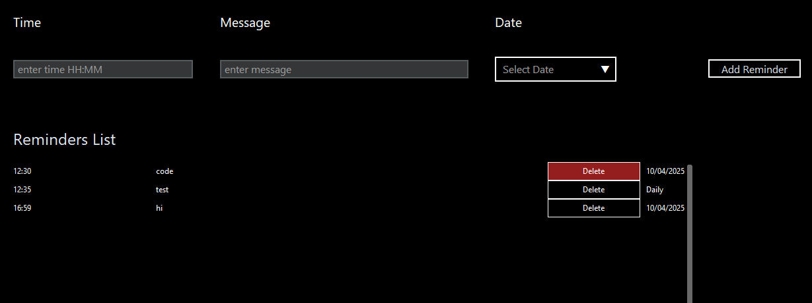

# Promptly 
Simple Reminder App for Desktop using Python

latest release notes [v0.1.1](https://github.com/jayant1211/promptly/releases/tag/v0.1.1)

---



## What it does

Promptly is a app to help you focus. Add time and a message, and when that time comes, the app flashes a full-screen black overlay with your message. Dismiss it by clicking, moving the mouse, or pressing any key. Keeps track of reminders, add/delete as you need.

## Usage

1. Download `.exe` from [here](https://github.com/jayant1211/promptly/releases/tag/v0.1.) and run directly
or

2. run from source
```bash
git clone https://github.com/jayant1211/promptly
cd promptly
pip install customtkinter pandas
python app.py
```

## To-dos

- [x] Add reminders
- [x] Display reminders in list
- [x] Full-screen flash alerts
- [x] Delete reminders
- [x] Input validation improvements
- [x] Date-based reminders
- [ ] Sort Reminders based on date/entry
- [ ] Recurring reminders
- [ ] Hotkey Support
- [ ] Background/system tray integration
- [ ] Sound notifications
- [ ] Switch storage to SQLite
- [ ] Calendar Integration
